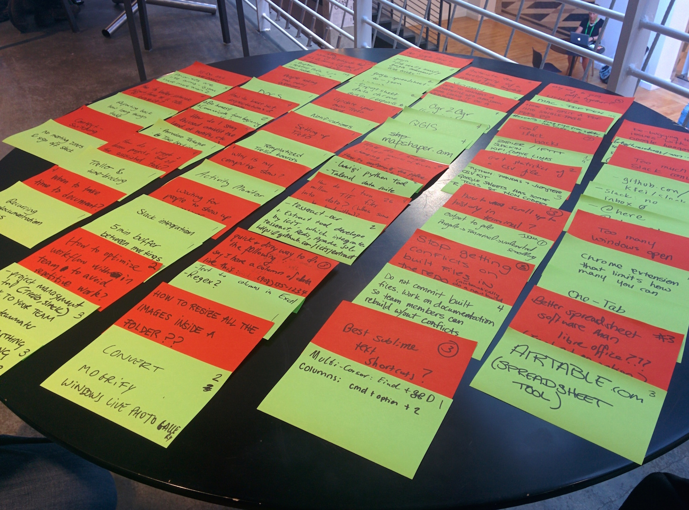

# Botillo

This repo is meant to serve as a future reference for productivity tips and unanswered needs from [2016 SRCCON](http://srccon.org/) participants. It will be an index to find solutions to some of the time consuming tasks that we all have thought of during the [Time Savers: Avoid boring tasks and learn productivity tips](http://schedule.srccon.org/#_session-tips-tricks) session.

## Session challenges

We are really happy with the participation during the session here is an image that reflects how it went.

* Red Post-Its (Challenges)
* Green Post-Its (Solutions)

## Layout

The repo consists of two main index files

* **[Technical Challenges](technical-challenges.md)**: An index solved/unsolved technical challenges and their solutions
* **[Time Management Challenges](time-management-challenges.md)**: An index solved/unsolved technical challenges and their solutions

## Contributing

If you see a task that you know how to solve we will be thrilled to receive pull requests and to include them on the repo. Just remember that this repo will serve as an index so it would be preferable that the solution includes a link to an external resource and that you submit a brief description with it.

## Authors & Contributors

Juan Elosua [@jjelosua](https://github.com/jjelosua) & Marta Alonso [@malon](https://github.com/malon)
